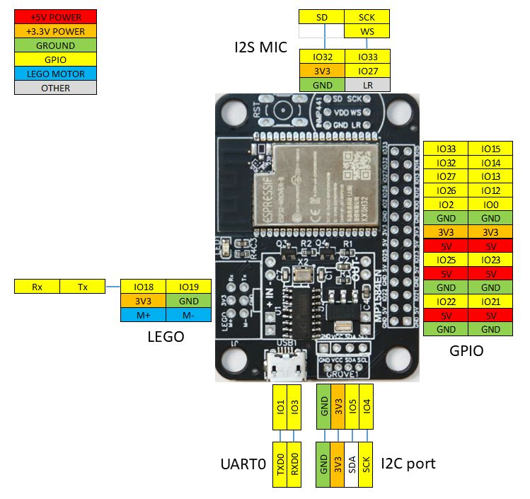

# LMS-ESP32 Testing

## How testing is performed

After production of the LMS-ESP32 board, an acceptance test needs to be performed
 that tests all the GPIO pins for good connection and checks for short circuits with 
surrounding pins. In each tests, two units are involved: the Tester Unit (TU), and the Device Under Test (DUT). The programm on the TU is run in and endless loop and can serve for testing of multple DUT's.

The TU is fitted with a NeoPixel LED connected to GPIO32.
 The NeoPixel indicates the state of the test.
- Orange: a new DUT can be inserted
- Green: 1 second, test succeeded succesfully
- Red: 5 brief flashes, test failed.

During the test serial output is provided on the Tester unit. Some examples of typical output can be seen [here](#example-output-of-tu).

## Executing the test
- Flash the same firmware on all devices (both the TU as well as the DUTs). 
- Connect a serial monitor (with logging to a file) at 115200 bit/s to the USB of the TU 
- Wait for the REPL prompt to show and execute this command:
```
import tester
```
- the following prompt will be visible:
```
*********************
* Ready for testing *
* Insert DUT in rig *
*********************
```
- connect a DUT 
- the test should be executed automatically as soon as the DUT gets power.

## Firmware

### DUT and production firmware
This firmware needs to be flashed on all the modules: [micropython_lms_esp32_20230401.bin](https://github.com/ste7anste7an/LMS-ESP32/raw/gh-pages/micropython_lms_esp32_20230401.bin). This can be done using the online tool: [https://espressif.github.io/esptool-js/](https://espressif.github.io/esptool-js/). Select port, erase flash and upload the firmware file and flash at 0x1000.
### Tester firmware
This firmware needs to be flashed only on the Tester Unit (TU): [micropython_lms_esp32_tester_20230402.bin](https://github.com/ste7anste7an/LMS-ESP32/raw/gh-pages/micropython_lms_esp32_tester_20230402.bin). This can be done using the online tool: [https://espressif.github.io/esptool-js/](https://espressif.github.io/esptool-js/). Select port, erase flash and upload the firmware file and flash at 0x1000. 

## Connecting TU to TUD



1) NeoPixel

|TU INMP441 |  NeoPixel|
|-------|------|
|SD/GPIO32 | Data |
| VCC | VCC |
| GND | GND|


2) UART

|TU GPIO | DUT GPIO | 
|--------|----------|
|GPIO18| GPIO19 |
|GPIO19| GPIO18 |

3) GPIO

|TU GPIO | DUT GPIO 
|-------|--------|
|GPIO0  |GPIO0 |
|GPIO2  |GPIO2 |
|GPIO4  |GPIO4 |
|GPIO5  |GPIO5 |
|GPIO12  |GPIO12 |
|GPIO13  |GPIO13 |
|GPIO14  |GPIO14 |
|GPIO15  |GPIO15 |
|GPIO21  |GPIO21 |
|GPIO22  |GPIO22 |
|GPIO23  |GPIO23 |
|GPIO25  |GPIO25 |
|GPIO26  |GPIO26 |
|GPIO27  |GPIO27 |
|GPIO32  |GPIO32 |
|GPIO33  |GPIO33 |


## Internals

Two Python modules are incorporated as frozen modules in the firmware: `test_dut.py` and `tester.py` for the DUT and TU device respectively. The `boot.py` file imports the `test_dut` module and starts the test when the DUT is powered on or rebooted.

1) Handshake

The TU and DUT communicate with a UART running in each device on GPIO18 and GPIO19 which are cross connected (GPIO18 of the TU to GPIO19 of the DUT and vice versa).

At boot, the DUT checks for the presence of the tester unit by sending `start`. If it not receives an ack message `ack` from the TU within 1000 ms, it quits the script and shows a REPL promt.

If it receives the `ack` message, it enters in testing mode where it perfoms the following actions:

2) test all pins high

The DUT loops over al used GPIO pins. In the loop a single pin is set to high while the other pins are put in high impedance input mode. The current pin is communicated to the TU by sending a `H<pin>` message to the TU. The TU reads the same list of GPIO's and checks that the current pin is high and all the other pins are low. The TU will set all GPIO's to IN with a PULL_DOWN resistor. (There is one exception, namelijk GPIO0, which is always pulled high using a pull up resistor.) The TU send an 'ack' message after checking the errors. Errors are counted, and as soon as a non responsive pin or a short circuit is encountered, a matrix is shown indicating the problematic pins:

```
[!] One or more pins are short circuited (S=short, .=ok, X=not connected, V=ok, 1=always high)


[*] -------------------------------------
[*] GP05 GP22 GP25 GP02 GP26 GP27 GP32 GP33 
[*]  [V]  [.]  [.]  [.]  [.]  [.]  [.]  [.] 
[*] GP04 GP21 GP23 GP00 GP12 GP13 GP14 GP15 
[*]  [S]  [.]  [.]  [1]  [.]  [.]  [.]  [.] 
```

3) test all pins low

The same procudure is followed as for the high pins, but exactly in the opposite way. The TU will set all GPIO's to IN with a PULL_UP resistor. 

4) conclusion of test

When all pins are checked for both high and low signals, the DUT sends a `stop` message to conclude the test. Upon receiving the `stop` message, the TU will show a summary of the errors. It will show either a green LED when the test is successful, or flash the red LED when a failure was detected. After that, the TU is ready for a new test and the LED will turn orange.


## Example output of TU
This shows per DUT the following information (if the test is successful):
```
*********************
* Ready for testing *
* Insert DUT in rig *
*********************
[*] Testing ID 4c11ae6464c0
[*] Test passed succesfully

```

If a test failes, the following information is (typically) shown. In this case, GPIO4 and GPIO5 were not connected:
```
*********************
* Ready for testing *
* Insert DUT in rig *
*********************
[*] Testing ID 4c11ae6464c0

[!] Error when setting pin GP05 high

[*] -------------------------------------
[*] GP05 GP22 GP25 GP02 GP26 GP27 GP32 GP33 
[*]  [X]  [.]  [.]  [.]  [.]  [.]  [.]  [.] 
[*] GP04 GP21 GP23 GP00 GP12 GP13 GP14 GP15 
[*]  [.]  [.]  [.]  [1]  [.]  [.]  [.]  [.] 

[!] Error when setting pin GP04 high

[*] -------------------------------------
[*] GP05 GP22 GP25 GP02 GP26 GP27 GP32 GP33 
[*]  [.]  [.]  [.]  [.]  [.]  [.]  [.]  [.] 
[*] GP04 GP21 GP23 GP00 GP12 GP13 GP14 GP15 
[*]  [X]  [.]  [.]  [1]  [.]  [.]  [.]  [.] 

[!] Error when setting pin GP05 low

[*] -------------------------------------
[*] GP05 GP22 GP25 GP02 GP26 GP27 GP32 GP33 
[*]  [X]  [.]  [.]  [.]  [.]  [.]  [.]  [.] 
[*] GP04 GP21 GP23 GP00 GP12 GP13 GP14 GP15 
[*]  [.]  [.]  [.]  [.]  [.]  [.]  [.]  [.] 

[!] Error when setting pin GP04 low

[*] -------------------------------------
[*] GP05 GP22 GP25 GP02 GP26 GP27 GP32 GP33 
[*]  [.]  [.]  [.]  [.]  [.]  [.]  [.]  [.] 
[*] GP04 GP21 GP23 GP00 GP12 GP13 GP14 GP15 
[*]  [X]  [.]  [.]  [.]  [.]  [.]  [.]  [.] 

[!] Test failed with 4 error(s)

```

In case there is a short circuit of neigboring pins,
 the following output is shown (GPIO4 and GPIO5 are 
short circuited, hence the 'S' is indicated):
```
*********************
* Ready for testing *
* Insert DUT in rig *
*********************
[*] Testing ID 4c11ae6464c0

[!] Error when setting pin GP05 high
[!] One or more pins are short circuited (S=short, .=ok, X=not connected, V=ok, 1=always high)


[*] -------------------------------------
[*] GP05 GP22 GP25 GP02 GP26 GP27 GP32 GP33 
[*]  [V]  [.]  [.]  [.]  [.]  [.]  [.]  [.] 
[*] GP04 GP21 GP23 GP00 GP12 GP13 GP14 GP15 
[*]  [S]  [.]  [.]  [1]  [.]  [.]  [.]  [.] 

[!] Error when setting pin GP04 high
[!] One or more pins are short circuited (S=short, .=ok, X=not connected, V=ok, 1=always high)


[*] -------------------------------------
[*] GP05 GP22 GP25 GP02 GP26 GP27 GP32 GP33 
[*]  [S]  [.]  [.]  [.]  [.]  [.]  [.]  [.] 
[*] GP04 GP21 GP23 GP00 GP12 GP13 GP14 GP15 
[*]  [V]  [.]  [.]  [1]  [.]  [.]  [.]  [.] 

[!] Error when setting pin GP05 low
[!] One or more pins are short circuited (S=short, .=ok, X=not connected, V=ok, 1=always high)


[*] -------------------------------------
[*] GP05 GP22 GP25 GP02 GP26 GP27 GP32 GP33 
[*]  [V]  [.]  [.]  [.]  [.]  [.]  [.]  [.] 
[*] GP04 GP21 GP23 GP00 GP12 GP13 GP14 GP15 
[*]  [S]  [.]  [.]  [.]  [.]  [.]  [.]  [.] 

[!] Error when setting pin GP04 low
[!] One or more pins are short circuited (S=short, .=ok, X=not connected, V=ok, 1=always high)


[*] -------------------------------------
[*] GP05 GP22 GP25 GP02 GP26 GP27 GP32 GP33 
[*]  [S]  [.]  [.]  [.]  [.]  [.]  [.]  [.] 
[*] GP04 GP21 GP23 GP00 GP12 GP13 GP14 GP15 
[*]  [V]  [.]  [.]  [.]  [.]  [.]  [.]  [.] 

[!] Test failed with 4 error(s)

```

